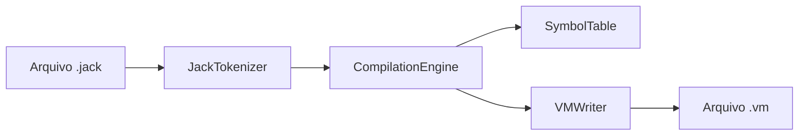

# Jack Compiler

> **Compilador completo para a linguagem Jack**, desenvolvido em **Java**, com suporte às fases de análise léxica, análise sintática e geração de código VM para a plataforma **Hack Virtual Machine**, conforme os Projetos 10 e 11 do curso **Nand2Tetris**.


---

## 📌 Descrição do Projeto

O **Jack Compiler** é um compilador acadêmico implementado manualmente, sem o uso de geradores sintáticos automatizados como **ANTLR**, **Lex/Yacc** ou ferramentas equivalentes.

O objetivo do projeto é traduzir programas escritos na linguagem de alto nível **Jack** para o código intermediário da **Máquina Virtual Hack**, gerando arquivos `.vm` compatíveis com o **VM Emulator** oficial do Nand2Tetris.

Este projeto contempla a evolução completa do compilador nas seguintes etapas:

- **Fase 1:** Análise léxica/tokenização do código-fonte Jack.
- **Fase 2:** Análise sintática por descida recursiva e geração de árvores XML.
- **Fase 3:** Geração de código VM, incluindo suporte a variáveis, sub-rotinas, controle de fluxo, arrays e orientação a objetos.

---

## 👨‍💻 Autor e Informações Acadêmicas

| Campo | Informação |
|---|---|
| **Autor** | João Victor Lima Ewerton - 20250013640 |
| **Instituição** | Universidade Federal do Maranhão - UFMA |
| **Disciplina** | Compiladores |
| **Projeto** | Jack Compiler & VM Translator |
| **Base conceitual** | Projetos 7, 8, 10 e 11 do Nand2Tetris |

---

## 🧠 Visão Geral da Arquitetura

A arquitetura do compilador foi organizada em módulos com responsabilidades bem definidas, seguindo o pipeline clássico de compilação: **entrada Jack → tokens → parsing → tabela de símbolos → geração VM**.



### 📁 Módulos Implementados

| Módulo | Responsabilidade |
|---|---|
| **JackCompiler** | Classe principal do projeto. Gerencia a entrada via terminal, detecta arquivos ou diretórios `.jack`, executa compilação em lote e gera arquivos `.vm` na mesma pasta de origem. |
| **JackTokenizer** | Analisador léxico. Remove comentários e espaços irrelevantes, aplica expressões regulares e classifica tokens como `KEYWORD`, `SYMBOL`, `IDENTIFIER`, `INT_CONST` e `STRING_CONST`. |
| **CompilationEngine** | Núcleo do compilador. Implementa o parser por **Recursive Descent Parsing** e realiza a geração de código VM dirigida pela sintaxe. |
| **SymbolTable** | Tabela de símbolos. Controla escopos de classe e sub-rotina, armazenando identificadores, tipos, categorias e índices de memória. |
| **VMWriter** | Camada de emissão de código VM. Centraliza a geração de comandos como `push`, `pop`, `label`, `goto`, `if-goto`, `call`, `function` e `return`. |
| **TokenType** | Enum auxiliar utilizado para padronizar os tipos de tokens reconhecidos pelo analisador léxico. |
| **JackAnalyzer** | Módulo legado/auxiliar das fases iniciais, usado para geração de XML de tokens e apoio à validação dos Projetos 10 e 11. |

---

## ⚙️ Recursos Técnicos Implementados

### ✅ Análise Léxica
O módulo `JackTokenizer` realiza a leitura do código-fonte Jack e executa:
- Remoção de comentários de linha (`//`) e bloco (`/* ... */`).
- Ignorância de espaços em branco fora de strings.
- Reconhecimento de palavras-chave da linguagem Jack.
- Reconhecimento de símbolos, identificadores, constantes inteiras e constantes string.

### ✅ Análise Sintática por Descida Recursiva
O `CompilationEngine` implementa a técnica de **Recursive Descent Parsing**, mapeando cada estrutura gramatical da linguagem Jack para métodos como `compileClass()`, `compileStatements()`, `compileExpression()`, entre outros.

### ✅ Geração de Código VM
A fase final do compilador gera comandos compatíveis com a **Hack Virtual Machine**, utilizando o módulo `VMWriter` para encapsular a escrita dos comandos (`push`, `pop`, `call`, `function`, etc.).

---

## 🛠️ VM Translator (Projetos 7 e 8)

Adicionalmente, este repositório contém a implementação completa do **VM Translator**, ferramenta que converte o código intermediário (.vm) para Assembly Hack (.asm). Ele engloba operações aritméticas, acesso à memória, controle de fluxo e chamadas de sub-rotinas (stack frames).

### 📁 Módulos do Tradutor

| Módulo | Responsabilidade |
|---|---|
| **VMTranslator** | Ponto de entrada. Gerencia leitura de arquivos individuais ou diretórios inteiros (`.vm`), acionando também a injeção do código de *Bootstrap*. |
| **Parser** | Analisa o código VM, extrai comandos e argumentos, removendo comentários. |
| **CodeWriter** | Implementa a tradução lógica de comandos VM para Assembly, gerenciando segmentos de memória, aritmética, controle de fluxo e *stack frames* de chamadas de funções. |

### 🚀 Como Executar o VMTranslator

```bash
# Compilar os arquivos
javac *.java

# Executar apontando para o arquivo ou diretório VM
java VMTranslator ./caminho/do/projeto/FibonacciElement
```

---

## 🚀 Como Compilar o JackCompiler

### 1. Acesse a pasta do projeto

```bash
cd /caminho/para/jack-compiler
```

### 2. Compile os módulos

```bash
javac JackCompiler.java CompilationEngine.java JackTokenizer.java TokenType.java SymbolTable.java VMWriter.java
```

### 3. Executar o JackCompiler

**Compilar um arquivo específico:**
```bash
java JackCompiler caminho/para/Main.jack
```

**Compilar uma pasta inteira:**
```bash
java JackCompiler ./tests/Square
```

---

## 🧪 Matriz de Testes Homologados

### Jack Compiler
| Teste | Objetivo | Resultado |
|---|---|---|
| **Seven** | Expressões e aritmética | ✅ Validado |
| **ConvertToBin** | `while`, `if`, variáveis | ✅ Validado |
| **Square** | POO e interatividade | ✅ Validado |

### VM Translator (Fases 7 e 8)
| Teste | Objetivo | Resultado |
|---|---|---|
| **SimpleAdd** | Aritmética básica | ✅ Validado |
| **BasicTest** | Acesso a memória | ✅ Validado |
| **PointerTest** | Ponteiros e endereçamento | ✅ Validado |
| **StackTest** | Lógica relacional | ✅ Validado |
| **StaticTest** | Variáveis estáticas | ✅ Validado |
| **BasicLoop** | Controle de fluxo (`goto`, `if-goto`) | ✅ Validado |
| **FibonacciSeries** | Controle de fluxo com ponteiros | ✅ Validado |
| **SimpleFunction** | Criação e retorno de sub-rotinas | ✅ Validado |
| **NestedCall** | Chamadas de funções aninhadas | ✅ Validado |
| **FibonacciElement** | Recursão e código de Bootstrap | ✅ Validado |
| **StaticsTest** | Múltiplos arquivos e estáticos | ✅ Validado |

---

## ✅ Status do Projeto

| Fase | Descrição | Status |
|---|---|---|
| **Fase 1** | Analisador léxico/tokenização | ✅ Implementado |
| **Fase 2** | Parser por descida recursiva/XML | ✅ Implementado |
| **Fase 3** | Geração de código VM | ✅ Implementado |
| **Proj 7 & 8**| Tradutor Completo (VM para Assembly) | ✅ Implementado (100% validado) |

---

## 📚 Referência Conceitual

Este projeto foi desenvolvido com base na arquitetura educacional proposta pelo curso **Nand2Tetris** (Projetos 7, 8, 10 e 11), implementado manualmente em Java.

---

## 🏁 Conclusão

O **Jack Compiler** e o **VM Translator** consolidam a implementação prática de ferramentas essenciais para a tradução de linguagens de alto nível para arquiteturas de hardware simulado, atendendo aos requisitos acadêmicos da disciplina de **Compiladores** da **Universidade Federal do Maranhão (UFMA)**.
