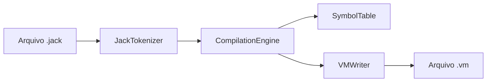

# Jack Compiler

> **Compilador completo para a linguagem Jack**, desenvolvido em **Java**, com suporte às fases de análise léxica, análise sintática e geração de código VM para a plataforma **Hack Virtual Machine**, conforme os Projetos 10 e 11 do curso **Nand2Tetris**.


---

## 📌 Descrição do Projeto

O **Jack Compiler** é um compilador acadêmico implementado manualmente, sem o uso de geradores sintáticos automatizados como **ANTLR**, **Lex/Yacc** ou ferramentas equivalentes.

O objetivo do projeto é traduzir programas escritos na linguagem de alto nível **Jack** para o código intermediário da **Máquina Virtual Hack**, gerando arquivos `.vm` compatíveis com o **VM Emulator** oficial do Nand2Tetris.

Este projeto contempla a evolução completa do compilador nas seguintes etapas:

- **Fase 1:** Análise léxica/tokenização do código-fonte Jack.
- **Fase 2:** Análise sintática por descida recursiva e geração de árvores XML.
- **Fase 3:** Geração de código VM, incluindo suporte a variáveis, sub-rotinas, controle de fluxo, arrays e orientação a objetos.

---

## 👨‍💻 Autor e Informações Acadêmicas

| Campo | Informação |
|---|---|
| **Autor** | João Victor Lima Ewerton |
| **Instituição** | Universidade Federal do Maranhão - UFMA |
| **Disciplina** | Compiladores |
| **Projeto** | Jack Compiler |
| **Base conceitual** | Projetos 10 e 11 do Nand2Tetris |

---

## 🧠 Visão Geral da Arquitetura

A arquitetura do compilador foi organizada em módulos com responsabilidades bem definidas, seguindo o pipeline clássico de compilação: **entrada Jack → tokens → parsing → tabela de símbolos → geração VM**.



### 📁 Módulos Implementados

| Módulo | Responsabilidade |
|---|---|
| **JackCompiler** | Classe principal do projeto. Gerencia a entrada via terminal, detecta arquivos ou diretórios `.jack`, executa compilação em lote e gera arquivos `.vm` na mesma pasta de origem. |
| **JackTokenizer** | Analisador léxico. Remove comentários e espaços irrelevantes, aplica expressões regulares e classifica tokens como `KEYWORD`, `SYMBOL`, `IDENTIFIER`, `INT_CONST` e `STRING_CONST`. |
| **CompilationEngine** | Núcleo do compilador. Implementa o parser por **Recursive Descent Parsing** e realiza a geração de código VM dirigida pela sintaxe. |
| **SymbolTable** | Tabela de símbolos. Controla escopos de classe e sub-rotina, armazenando identificadores, tipos, categorias e índices de memória. |
| **VMWriter** | Camada de emissão de código VM. Centraliza a geração de comandos como `push`, `pop`, `label`, `goto`, `if-goto`, `call`, `function` e `return`. |
| **TokenType** | Enum auxiliar utilizado para padronizar os tipos de tokens reconhecidos pelo analisador léxico. |
| **JackAnalyzer** | Módulo legado/auxiliar das fases iniciais, usado para geração de XML de tokens e apoio à validação dos Projetos 10 e 11. |

---

## ⚙️ Recursos Técnicos Implementados

### ✅ Análise Léxica

O módulo `JackTokenizer` realiza a leitura do código-fonte Jack e executa:

- Remoção de comentários de linha (`//`) e bloco (`/* ... */`).
- Ignorância de espaços em branco fora de strings.
- Reconhecimento de palavras-chave da linguagem Jack.
- Reconhecimento de símbolos, identificadores, constantes inteiras e constantes string.
- Extração do conteúdo de strings sem aspas externas.

Tipos de token suportados:

```java
KEYWORD, SYMBOL, IDENTIFIER, INT_CONST, STRING_CONST
```

---

### ✅ Análise Sintática por Descida Recursiva

O `CompilationEngine` implementa a técnica de **Recursive Descent Parsing**, em que cada estrutura gramatical da linguagem Jack é mapeada para um método específico.

Entre os métodos centrais estão:

- `compileClass()`
- `compileClassVarDec()`
- `compileSubroutine()`
- `compileParameterList()`
- `compileVarDec()`
- `compileStatements()`
- `compileLet()`
- `compileIf()`
- `compileWhile()`
- `compileDo()`
- `compileReturn()`
- `compileExpression()`
- `compileTerm()`
- `compileExpressionList()`

Essa abordagem torna o compilador mais didático, rastreável e alinhado à gramática formal da linguagem Jack.

---

### ✅ Geração de Código VM

A fase final do compilador gera comandos compatíveis com a **Hack Virtual Machine**.

Exemplos de comandos emitidos:

```vm
push constant 7
pop local 0
label WHILE_EXP0
if-goto IF_TRUE0
call Memory.alloc 1
function Main.main 2
return
```

O módulo `VMWriter` encapsula a escrita desses comandos, evitando acoplamento direto entre a lógica de parsing e a formatação textual do código VM.

---

## 🚀 Recursos Avançados da Fase 3

### 🔁 Controle de Fluxo

O compilador implementa a tradução completa de estruturas condicionais e laços:

- `while`
- `if`
- `if-else`

Para isso, são gerados rótulos internos únicos, como:

```vm
label WHILE_EXP0
goto WHILE_EXP0
label WHILE_END0
label IF_TRUE0
label IF_FALSE0
label IF_END0
```

Essa estratégia garante o fluxo correto de execução na VM, inclusive em blocos aninhados.

---

### 🧮 Expressões e Operadores

O compilador suporta expressões aritméticas, lógicas e relacionais da linguagem Jack.

| Operador Jack | Tradução VM |
|---|---|
| `+` | `add` |
| `-` | `sub` |
| `*` | `call Math.multiply 2` |
| `/` | `call Math.divide 2` |
| `&` | `and` |
| `\|` | `or` |
| `<` | `lt` |
| `>` | `gt` |
| `=` | `eq` |
| `~` | `not` |
| `-` unário | `neg` |

Também há suporte a:

- Constantes inteiras.
- Constantes string com chamadas para `String.new` e `String.appendChar`.
- Palavras-chave constantes: `true`, `false`, `null` e `this`.
- Chamadas de função, método e construtor.

---

### 🧱 Tabela de Símbolos e Escopos

A `SymbolTable` gerencia dois níveis de escopo:

#### Escopo de Classe

| Kind | Segmento VM |
|---|---|
| `STATIC` | `static` |
| `FIELD` | `this` |

#### Escopo de Sub-rotina

| Kind | Segmento VM |
|---|---|
| `ARG` | `argument` |
| `VAR` | `local` |

Cada identificador recebe:

- **Nome**
- **Tipo**
- **Categoria**
- **Índice sequencial** dentro do segmento correspondente

Esse mapeamento permite que variáveis Jack sejam traduzidas corretamente para segmentos da VM.

---

### 📦 Manipulação de Arrays

A implementação suporta acesso e atribuição em arrays usando aritmética de ponteiros.

Para expressões como:

```jack
let a[i] = value;
```

O compilador calcula:

```text
endereço efetivo = endereço base do array + índice
```

Em seguida, utiliza os segmentos:

- `pointer 1` para apontar `THAT` para o endereço calculado.
- `that 0` para acessar ou modificar o valor armazenado no array.
- `temp 0` como registrador temporário durante atribuições.

Esse fluxo é essencial para preservar corretamente o valor da expressão antes de redirecionar o ponteiro `THAT`.

---

### 🧩 Suporte à Orientação a Objetos

A fase 3 inclui suporte às principais estruturas orientadas a objetos da linguagem Jack.

#### Construtores

Construtores alocam espaço na heap de acordo com a quantidade de campos (`field`) da classe:

```vm
push constant <quantidade_de_fields>
call Memory.alloc 1
pop pointer 0
```

Isso configura o ponteiro `this` para apontar para o novo objeto criado.

#### Métodos

Em métodos de instância, o compilador mapeia o objeto atual como primeiro argumento implícito:

```vm
push argument 0
pop pointer 0
```

Além disso, em chamadas de método, a instância atual ou o objeto resolvido na tabela de símbolos é passado implicitamente como argumento adicional.

#### Funções

Funções estáticas ou independentes são traduzidas sem manipulação automática do ponteiro `this`, seguindo o modelo padrão de chamadas da VM.

---

## 🛠️ Tecnologias Utilizadas

- **Java**
- **JDK**
- **Regex** para análise léxica
- **Recursive Descent Parsing** para análise sintática
- **Hack Virtual Machine**
- **Nand2Tetris VM Emulator**
- **WSL2 - Ubuntu**
- **VS Code**
- **Terminal Windows / PowerShell**

---

## 📂 Estrutura Sugerida do Projeto

```text
jack-compiler/
├── JackCompiler.java
├── JackTokenizer.java
├── CompilationEngine.java
├── SymbolTable.java
├── VMWriter.java
├── TokenType.java
├── JackAnalyzer.java
├── README.md
└── tests/
    ├── Seven/
    ├── ConvertToBin/
    └── Square/
```

> A pasta `tests/` é apenas uma organização sugerida. O compilador aceita tanto um arquivo `.jack` isolado quanto uma pasta contendo múltiplos arquivos `.jack`.

---

## 🚀 Como Compilar o Projeto

### 1. Acesse a pasta do projeto

No WSL2/Ubuntu:

```bash
cd /caminho/para/jack-compiler
```

Exemplo em ambiente WSL integrado ao Windows:

```bash
cd ~/www/jack-compiler
```

---

### 2. Compile os módulos principais do compilador

```bash
javac JackCompiler.java CompilationEngine.java JackTokenizer.java TokenType.java SymbolTable.java VMWriter.java
```

Esse comando gera os arquivos `.class` necessários para executar o compilador final da fase 3.

> Observação: o arquivo `JackAnalyzer.java` é mantido como módulo legado das fases XML. Caso ele seja usado junto ao tokenizer atual, valide a compatibilidade do construtor utilizado antes de compilar todos os arquivos com `javac *.java`.

---

## ▶️ Como Executar o JackCompiler

O compilador aceita dois tipos de entrada:

1. Um único arquivo `.jack`.
2. Um diretório contendo vários arquivos `.jack`.

### Compilar um arquivo específico

```bash
java JackCompiler caminho/para/Main.jack
```

Exemplo:

```bash
java JackCompiler ./tests/Seven/Main.jack
```

Saída esperada:

```text
A COMPILAR: .../Main.jack
A GERAR VM EM: .../Main.vm
```

---

### Compilar uma pasta inteira

```bash
java JackCompiler caminho/para/pasta
```

Exemplo:

```bash
java JackCompiler ./tests/Square
```

O compilador irá buscar todos os arquivos `.jack` dentro da pasta e gerar os respectivos arquivos `.vm` no mesmo diretório.

Exemplo:

```text
Square/
├── Main.jack
├── Main.vm
├── Square.jack
├── Square.vm
├── SquareGame.jack
└── SquareGame.vm
```

---

## 🧪 Matriz de Testes Homologados

Os testes foram validados com os programas oficiais do Nand2Tetris, usando o **VM Emulator**.

| Teste | Objetivo | Recursos Validados | Resultado |
|---|---|---|---|
| **Seven** | Validar expressões matemáticas puras e precedência operacional via pilha. | Expressões, constantes inteiras, operações aritméticas e chamada de saída. | ✅ Imprimiu o número `7` com sucesso. |
| **ConvertToBin** | Validar conversão binária com lógica condicional e repetição. | `while`, `if`, variáveis locais, comparação, atribuição e script automatizado. | ✅ Passou no script `ConvertToBinVME.tst` com comparação de RAM bem-sucedida. |
| **Square** | Validar programa interativo com orientação a objetos. | Construtores, métodos, heap, ponteiro `this`, leitura de teclado, gráficos e chamadas entre classes. | ✅ Jogo executado no VM Emulator sem erros. |

---

## 🧬 Como Rodar os Arquivos `.vm` no VM Emulator

Após compilar os arquivos `.jack`, os arquivos `.vm` gerados devem ser executados no **VM Emulator** oficial do Nand2Tetris.

### Opção 1: Execução com script `.tst`

Essa opção é indicada para testes automatizados, como `Seven` e `ConvertToBin`.

1. Abra o **VM Emulator**.
2. Carregue o script `.tst` correspondente ao teste.
3. Execute o script.
4. Verifique se o resultado final corresponde ao esperado.

No Windows, normalmente o emulator fica na pasta `tools` do Nand2Tetris:

```powershell
cd C:\caminho\para\nand2tetris\tools
.\VMEmulator.bat
```

No Linux/WSL, caso os scripts estejam disponíveis:

```bash
cd /caminho/para/nand2tetris/tools
./VMEmulator.sh
```

Fluxo recomendado:

```text
Compilar .jack → gerar .vm → abrir VM Emulator → carregar .tst → executar script → validar saída/RAM
```

---

### Opção 2: Execução interativa de programas

Essa opção é indicada para programas como `Square`, que dependem de interação em tempo real.

1. Compile a pasta inteira do programa:

```bash
java JackCompiler ./tests/Square
```

2. Abra o **VM Emulator**.
3. Carregue a pasta do programa, não apenas um arquivo `.vm` isolado.
4. Garanta que todos os `.vm` necessários estejam no mesmo diretório.
5. Execute o programa no modo interativo.
6. Interaja com teclado e interface gráfica conforme previsto pelo teste.

Para o caso do `Square`, a pasta deve conter arquivos como:

```text
Main.vm
Square.vm
SquareGame.vm
```

O carregamento da pasta inteira é importante porque programas orientados a objetos fazem chamadas entre classes diferentes.

---

## 🧭 Fluxo de Uso Recomendado

```bash
# 1. Entrar na pasta do compilador
cd ~/www/jack-compiler

# 2. Compilar os módulos principais
javac JackCompiler.java CompilationEngine.java JackTokenizer.java TokenType.java SymbolTable.java VMWriter.java

# 3. Compilar um programa Jack completo
java JackCompiler ./tests/Square

# 4. Abrir o VM Emulator e carregar a pasta ./tests/Square
```

---

## ✅ Status do Projeto

| Fase | Descrição | Status |
|---|---|---|
| **Fase 1** | Analisador léxico/tokenização | ✅ Implementado |
| **Fase 2** | Parser por descida recursiva/XML | ✅ Implementado como etapa auxiliar/legada |
| **Fase 3** | Geração de código VM | ✅ Implementado |
| **Testes VM** | Seven, ConvertToBin e Square | ✅ Homologados |

---

## 📚 Referência Conceitual

Este projeto foi desenvolvido com base na arquitetura educacional proposta pelo curso **Nand2Tetris**, especialmente nos projetos:

- **Project 10:** Compiler I - Syntax Analysis
- **Project 11:** Compiler II - Code Generation

A implementação foi feita manualmente em Java, reforçando os conceitos de:

- Análise léxica.
- Análise sintática.
- Tabela de símbolos.
- Tradução dirigida pela sintaxe.
- Geração de código intermediário.
- Organização de memória em máquina virtual.

---

## 🏁 Conclusão

O **Jack Compiler** consolida a implementação prática de um compilador funcional para a linguagem Jack, cobrindo desde a leitura e classificação de tokens até a geração de código VM executável.

Além de atender aos requisitos acadêmicos da disciplina de **Compiladores** da **Universidade Federal do Maranhão**, o projeto demonstra domínio sobre as etapas centrais de construção de compiladores, incluindo escopos, memória, chamadas de sub-rotina, orientação a objetos e execução em máquina virtual.
